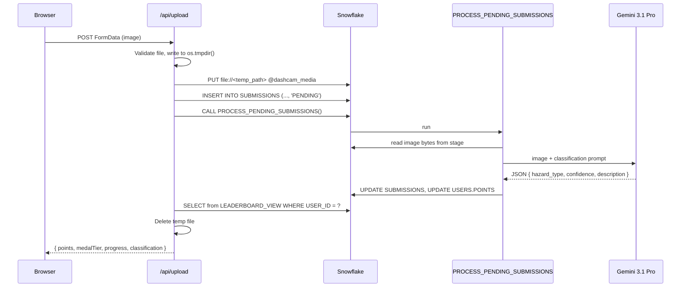

# Hazard Hunters — Project Plan

> Gamified road-hazard reporting. Drivers upload dashcam images, AI classifies the hazard, and every verified report earns points toward Clash Royale–style medal tiers on a global leaderboard.

**Status:** Draft · **Last updated:** 2026-09-26

Sections marked **_Proposal_** are design decisions not defined in the original spec. Review and adjust them before implementation.

---

## Table of Contents

1. [Overview](#1-overview)
2. [Goals & Non-Goals](#2-goals--non-goals)
3. [Tech Stack](#3-tech-stack)
4. [System Architecture](#4-system-architecture)
5. [Medal Progression System](#5-medal-progression-system)
6. [Scoring Rules (Proposal)](#6-scoring-rules-proposal)
7. [Snowflake Data Model](#7-snowflake-data-model)
8. [AI Processing Procedure (Proposal)](#8-ai-processing-procedure-proposal)
9. [Next.js Architecture](#9-nextjs-architecture)
10. [API Contracts](#10-api-contracts)
11. [Environment & Configuration](#11-environment--configuration)
12. [Implementation Milestones](#12-implementation-milestones)
13. [Testing & Verification](#13-testing--verification)
14. [Risks & Open Questions](#14-risks--open-questions)
15. [Stretch Goals](#15-stretch-goals)

---

## 1. Overview

### Problem
Potholes, debris, flooding, and broken signals often go unreported, or they're reported late. Drivers see these hazards every day but have no easy reason to report them.

### Solution
Hazard Hunters turns hazard reporting into a game:

1. A driver uploads a dashcam image.
2. The image is stored in Snowflake and classified by **Gemini 3.1 Pro**.
3. Verified hazards earn points.
4. Points unlock **medal tiers** (Scout → Apex Driver).
5. Drivers compete on a **global leaderboard**.

### Core Loop

```
Upload → AI Classify → Earn Points → Rank Up Medal → Climb Leaderboard → Upload again
```

### Target Users
- Commuters and rideshare drivers with dashcams
- Local driving communities
- Demo audience: hackathon judges (the MVP is built for a live demo)

---

## 2. Goals & Non-Goals

### MVP Goals
- [ ] Log in with a username (demo auth)
- [ ] Upload an image with drag-and-drop from the dashboard
- [ ] Classify the image with AI inside Snowflake and award points
- [ ] Show current points, medal tier, and progress to the next tier
- [ ] Show a global leaderboard with top-3 styling and grouping by tier

### Non-Goals (for MVP)
- Production authentication (OAuth, passwords, sessions)
- Native mobile app
- Maps, geolocation, or hazard clustering
- Moderation or admin tooling
- Reporting hazards to city agencies

These are candidates for [Stretch Goals](#15-stretch-goals).

---

## 3. Tech Stack

| Layer | Technology | Notes |
|---|---|---|
| Framework | **Next.js (App Router)** + TypeScript | Server Components for data pages, Route Handlers for the API |
| Styling | **Tailwind CSS** | Custom colors for each medal tier |
| DB driver | **`snowflake-sdk`** (Node.js) | Needs the **Node.js runtime**. Won't run on Edge. Set `export const runtime = "nodejs"` in each route |
| Data platform | **Snowflake** | Internal stage, tables, view, stored procedure |
| AI | **Gemini 3.1 Pro** | Called from a Snowflake stored procedure |
| Hosting | Vercel or local `next dev` | For the demo, local is fine |

---

## 4. System Architecture

### Component Diagram

```mermaid
flowchart LR
    subgraph Browser
        D[Dashboard /]
        L[Leaderboard /leaderboard]
        LG[Login /login]
    end

    subgraph NextJS["Next.js (Node runtime)"]
        AU[POST /api/upload]
        AL[GET /api/leaderboard]
        ALG[POST /api/login]
        AM[GET /api/me]
        SF[lib/snowflake.ts]
    end

    subgraph Snowflake
        ST[(@dashcam_media stage)]
        U[(USERS)]
        S[(SUBMISSIONS)]
        V[[LEADERBOARD_VIEW]]
        P{{PROCESS_PENDING_SUBMISSIONS}}
    end

    G[Gemini 3.1 Pro API]

    D --> AU & AM
    L --> AL
    LG --> ALG
    AU & AL & ALG & AM --> SF
    SF --> ST & S & U & V & P
    P --> ST
    P --> G
    P --> S & U
    V --> U
```

### Upload Sequence



---

## 5. Medal Progression System

Tiers are modeled on Clash Royale's arena and league progression.

| Tier | Points Range | Next Threshold | Suggested Color | Suggested Icon |
|---|---|---|---|---|
| **Scout** | 0 – 499 | 500 | Slate `#64748B` | 🔍 |
| **Pathfinder** | 500 – 1,499 | 1,500 | Emerald `#10B981` | 🧭 |
| **Trailblazer** | 1,500 – 2,999 | 3,000 | Sky `#0EA5E9` | 🔥 |
| **Road Warrior** | 3,000 – 4,999 | 5,000 | Violet `#8B5CF6` | ⚔️ |
| **Apex Driver** | 5,000+ | — (max) | Amber/Gold `#F59E0B` | 👑 |

### Progress Formula

For every tier except the last:

```
PROGRESS_PERCENTAGE = (POINTS - TIER_FLOOR) / (NEXT_TIER_THRESHOLD - TIER_FLOOR) * 100
```

Apex Driver always shows **100%**.

Example: 2,250 points → Trailblazer, floor 1,500, next 3,000 → (750 / 1,500) × 100 = **50%**.

### Single Source of Truth
The tier logic lives in **`LEADERBOARD_VIEW`** in Snowflake. The frontend reads `MEDAL_TIER`, `NEXT_TIER_THRESHOLD`, and `PROGRESS_PERCENTAGE` from the view and doesn't recompute them.

A small `lib/medals.ts` holds tier **display metadata** only: colors, icons, and the ordering used to group the leaderboard.

---

## 6. Scoring Rules (Proposal)

The spec doesn't define how many points a submission earns. Proposed rules:

| Hazard Type (`hazard_type`) | Points |
|---|---|
| `POTHOLE` | 100 |
| `DEBRIS` | 75 |
| `FLOODING` | 150 |
| `BROKEN_TRAFFIC_SIGNAL` | 125 |
| `ACCIDENT` | 150 |
| `CONSTRUCTION_UNMARKED` | 100 |
| `OTHER_HAZARD` | 50 |
| `NO_HAZARD` | 0 |

**Rules:**
- Points are awarded only when `confidence >= 0.6`. Below that, the submission is stored as `PROCESSED` with `POINTS_AWARDED = 0`.
- **Duplicate prevention:** the server stores a SHA-256 hash of each file (`FILE_HASH`). If the same user uploads the same hash again, the server rejects it with `409`.
- The points table lives in a small Snowflake table, `HAZARD_POINTS`, so it can be tuned without redeploying.

---

## 7. Snowflake Data Model

### 7.1 Database Objects

```sql
CREATE DATABASE IF NOT EXISTS HAZARD_HUNTERS;
CREATE SCHEMA IF NOT EXISTS HAZARD_HUNTERS.APP;
USE SCHEMA HAZARD_HUNTERS.APP;
```

### 7.2 `USERS`

```sql
CREATE TABLE IF NOT EXISTS USERS (
    USER_ID     STRING        DEFAULT UUID_STRING() PRIMARY KEY,
    USERNAME    STRING        NOT NULL UNIQUE,
    POINTS      NUMBER(10,0)  NOT NULL DEFAULT 0,
    CREATED_AT  TIMESTAMP_NTZ DEFAULT CURRENT_TIMESTAMP()
);
```

> Snowflake doesn't enforce `UNIQUE` or `PRIMARY KEY`. The login route must upsert with `MERGE` so usernames stay unique.

### 7.3 `SUBMISSIONS`

```sql
CREATE TABLE IF NOT EXISTS SUBMISSIONS (
    SUBMISSION_ID   STRING        DEFAULT UUID_STRING() PRIMARY KEY,
    USER_ID         STRING        NOT NULL,
    FILE_NAME       STRING        NOT NULL,
    FILE_HASH       STRING,                          -- Proposal: duplicate detection
    STATUS          STRING        NOT NULL DEFAULT 'PENDING',  -- PENDING | PROCESSED | FAILED
    HAZARD_TYPE     STRING,
    CONFIDENCE      FLOAT,
    DESCRIPTION     STRING,
    POINTS_AWARDED  NUMBER(10,0)  DEFAULT 0,
    AI_RAW          VARIANT,                         -- full Gemini response for debugging
    ERROR_MESSAGE   STRING,
    CREATED_AT      TIMESTAMP_NTZ DEFAULT CURRENT_TIMESTAMP(),
    PROCESSED_AT    TIMESTAMP_NTZ
);
```

### 7.4 `HAZARD_POINTS` (Proposal)

```sql
CREATE TABLE IF NOT EXISTS HAZARD_POINTS (
    HAZARD_TYPE STRING PRIMARY KEY,
    POINTS      NUMBER(10,0) NOT NULL
);

INSERT INTO HAZARD_POINTS VALUES
  ('POTHOLE',100), ('DEBRIS',75), ('FLOODING',150),
  ('BROKEN_TRAFFIC_SIGNAL',125), ('ACCIDENT',150),
  ('CONSTRUCTION_UNMARKED',100), ('OTHER_HAZARD',50), ('NO_HAZARD',0);
```

### 7.5 Internal Stage

```sql
CREATE STAGE IF NOT EXISTS dashcam_media
  DIRECTORY = (ENABLE = TRUE)
  ENCRYPTION = (TYPE = 'SNOWFLAKE_SSE');
```

> `SNOWFLAKE_SSE` (server-side encryption) lets the stored procedure read files through `SnowflakeFile` and scoped URLs.

### 7.6 `LEADERBOARD_VIEW` (from spec)

```sql
CREATE OR REPLACE VIEW LEADERBOARD_VIEW AS
SELECT 
    USER_ID,
    USERNAME,
    POINTS,
    CASE 
        WHEN POINTS < 500 THEN 'Scout'
        WHEN POINTS < 1500 THEN 'Pathfinder'
        WHEN POINTS < 3000 THEN 'Trailblazer'
        WHEN POINTS < 5000 THEN 'Road Warrior'
        ELSE 'Apex Driver'
    END AS MEDAL_TIER,
    CASE 
        WHEN POINTS < 500 THEN 500
        WHEN POINTS < 1500 THEN 1500
        WHEN POINTS < 3000 THEN 3000
        WHEN POINTS < 5000 THEN 5000
        ELSE POINTS
    END AS NEXT_TIER_THRESHOLD,
    CASE 
        WHEN POINTS < 5000 THEN 
            ((POINTS - IFF(POINTS < 500, 0, IFF(POINTS < 1500, 500, IFF(POINTS < 3000, 1500, 3000))))::FLOAT / 
            (IFF(POINTS < 500, 500, IFF(POINTS < 1500, 1500, IFF(POINTS < 3000, 3000, 5000))) - IFF(POINTS < 500, 0, IFF(POINTS < 1500, 500, IFF(POINTS < 3000, 1500, 3000))))::FLOAT) * 100
        ELSE 100
    END AS PROGRESS_PERCENTAGE
FROM USERS
ORDER BY POINTS DESC;
```

> **Note:** Snowflake doesn't guarantee that an `ORDER BY` inside a view carries through to queries on that view. Every query against the view should include its own `ORDER BY POINTS DESC`.
>
> **Optional enhancement:** add `RANK() OVER (ORDER BY POINTS DESC) AS RANK` to the view so the UI can show a stable rank number, with tied users sharing the same rank.

---

## 8. AI Processing Procedure (Proposal)

The spec calls `CALL PROCESS_PENDING_SUBMISSIONS()` to trigger Gemini 3.1 Pro. Snowflake can't reach the Gemini API by default, so the call goes out through an **External Access Integration** from a **Snowpark Python** procedure.

### 8.1 Network & Secret Setup (ACCOUNTADMIN)

```sql
CREATE OR REPLACE NETWORK RULE gemini_egress
  MODE = EGRESS TYPE = HOST_PORT
  VALUE_LIST = ('generativelanguage.googleapis.com');

CREATE OR REPLACE SECRET gemini_api_key
  TYPE = GENERIC_STRING
  SECRET_STRING = '<GEMINI_API_KEY>';

CREATE OR REPLACE EXTERNAL ACCESS INTEGRATION gemini_access
  ALLOWED_NETWORK_RULES = (gemini_egress)
  ALLOWED_AUTHENTICATION_SECRETS = (gemini_api_key)
  ENABLED = TRUE;
```

### 8.2 Procedure Logic

```
PROCESS_PENDING_SUBMISSIONS():
  for each row in SUBMISSIONS where STATUS = 'PENDING' (limit N):
    try:
      bytes   = read @dashcam_media/<FILE_NAME>          -- SnowflakeFile.open(scoped URL)
      result  = call Gemini 3.1 Pro (image + prompt), expect strict JSON
      pts     = HAZARD_POINTS[result.hazard_type] if result.confidence >= 0.6 else 0
      BEGIN TRANSACTION
        UPDATE SUBMISSIONS SET STATUS='PROCESSED', HAZARD_TYPE, CONFIDENCE,
               DESCRIPTION, POINTS_AWARDED=pts, AI_RAW, PROCESSED_AT=now()
        UPDATE USERS SET POINTS = POINTS + pts WHERE USER_ID = row.USER_ID
      COMMIT
    except e:
      UPDATE SUBMISSIONS SET STATUS='FAILED', ERROR_MESSAGE=e
  return summary JSON { processed, failed }
```

### 8.3 Skeleton

```sql
CREATE OR REPLACE PROCEDURE PROCESS_PENDING_SUBMISSIONS()
  RETURNS VARIANT
  LANGUAGE PYTHON
  RUNTIME_VERSION = '3.11'
  PACKAGES = ('snowflake-snowpark-python', 'requests')
  HANDLER = 'run'
  EXTERNAL_ACCESS_INTEGRATIONS = (gemini_access)
  SECRETS = ('api_key' = gemini_api_key)
AS
$$
import base64, json, requests, _snowflake
from snowflake.snowpark.files import SnowflakeFile

MODEL = "gemini-3.1-pro"   # confirm exact model id
PROMPT = """..."""         # see 8.4

def classify(image_bytes, mime):
    key = _snowflake.get_generic_secret_string('api_key')
    url = f"https://generativelanguage.googleapis.com/v1beta/models/{MODEL}:generateContent?key={key}"
    body = {
        "contents": [{"parts": [
            {"text": PROMPT},
            {"inline_data": {"mime_type": mime, "data": base64.b64encode(image_bytes).decode()}}
        ]}],
        "generationConfig": {"responseMimeType": "application/json"}
    }
    r = requests.post(url, json=body, timeout=60)
    r.raise_for_status()
    raw = r.json()
    text = raw["candidates"][0]["content"]["parts"][0]["text"]
    return json.loads(text), raw

def run(session):
    # 1. SELECT pending rows
    # 2. For each: build scoped URL, read bytes, classify, look up points, update in a transaction
    # 3. Return { processed, failed }
    ...
$$;
```

### 8.4 Classification Prompt

```
You are a road-safety classifier for dashcam images.
Classify the MOST significant road hazard visible.

Respond with ONLY a JSON object:
{
  "hazard_type": one of ["POTHOLE","DEBRIS","FLOODING","BROKEN_TRAFFIC_SIGNAL",
                         "ACCIDENT","CONSTRUCTION_UNMARKED","OTHER_HAZARD","NO_HAZARD"],
  "confidence": number between 0 and 1,
  "description": short sentence (max 20 words) describing the hazard
}

If the image is not a road/driving scene, return "NO_HAZARD" with confidence 1.
```

### 8.5 Concurrency Note
If two uploads call the procedure at the same moment, both could pick up the same `PENDING` row. To prevent this:
- The procedure first claims rows with `UPDATE ... SET STATUS='PROCESSING' WHERE STATUS='PENDING' AND SUBMISSION_ID = ?`, **or**
- The upload route passes its own `SUBMISSION_ID` so the procedure processes only that row. A variant, `PROCESS_SUBMISSION(id)`, is the simpler option for the MVP.

---

## 9. Next.js Architecture

### 9.1 Folder Structure

```
hazardhunters/
├── app/
│   ├── layout.tsx               # Nav bar (Dashboard · Leaderboard), Tailwind globals
│   ├── page.tsx                 # Dashboard & Upload
│   ├── login/page.tsx           # Username entry (demo auth)
│   ├── leaderboard/page.tsx     # Global rankings
│   └── api/
│       ├── login/route.ts       # POST: upsert user, set cookie
│       ├── me/route.ts          # GET: current user's row from LEADERBOARD_VIEW
│       ├── upload/route.ts      # POST: stage → insert → process → result
│       └── leaderboard/route.ts # GET: top 100
├── components/
│   ├── MedalBadge.tsx
│   ├── ProgressBar.tsx
│   ├── UploadDropzone.tsx
│   ├── ResultCard.tsx
│   └── LeaderboardRow.tsx
├── lib/
│   ├── snowflake.ts             # connection singleton + promisified execute()
│   ├── medals.ts                # tier display metadata (color, icon, order)
│   └── auth.ts                  # read/write USER_ID cookie
├── middleware.ts                # redirect to /login if no cookie
├── docs/
│   └── PLAN.md
└── .env.local
```

### 9.2 `lib/snowflake.ts`

- Create **one connection per server process** and reuse it (a module-level singleton), so a request doesn't pay for a new connection.
- Wrap `connection.execute` in a Promise-based helper:

```ts
export async function query<T = any>(sqlText: string, binds: any[] = []): Promise<T[]> {
  const conn = await getConnection();
  return new Promise((resolve, reject) => {
    conn.execute({
      sqlText,
      binds,
      complete: (err, _stmt, rows) => (err ? reject(err) : resolve((rows ?? []) as T[])),
    });
  });
}
```

- Always use **bind parameters (`?`)**. Never build SQL by concatenating user input.
- `PUT` can't take bind parameters. Build the path from a server-generated UUID file name only.

### 9.3 Demo Authentication

- `/login`: the user enters a username and it's sent with `POST /api/login`.
- The server runs a `MERGE` into `USERS` and gets back the `USER_ID`. It sets an httpOnly cookie, `hh_user_id`.
- `middleware.ts` redirects any request without the cookie to `/login`. `/login` and `/api/login` are excluded.
- This is **not secure**: anyone can type any username. It's acceptable only for the demo.

### 9.4 Dashboard: `app/page.tsx`

- **Header card:** username, `MedalBadge` (tier icon and color), total points.
- **ProgressBar:** fills to `PROGRESS_PERCENTAGE` with the text "X / NEXT_TIER_THRESHOLD pts to *Next Tier*". Apex Driver shows "Max tier reached 👑".
- **UploadDropzone** (client component):
  - Drag-and-drop area plus a "Browse" button, with a preview thumbnail.
  - Accepts `image/jpeg`, `image/png`, `image/webp`, up to 10 MB.
  - Sends `FormData` (`file`) to `/api/upload` and shows a loading state ("Analyzing hazard…"). The AI call can take a few seconds.
- **ResultCard:** hazard type, confidence %, description, "+N points".
  - If the upload crosses a tier boundary, show a **tier-up animation**, Clash Royale style.
- Refresh the header after each upload using the returned values. No extra fetch is needed.

### 9.5 Leaderboard: `app/leaderboard/page.tsx`

- A Server Component that fetches `/api/leaderboard`, or calls `query()` directly.
- **Top 3** get podium styling:
  - 🥇 Gold: `bg-gradient-to-r from-yellow-300 to-amber-500`
  - 🥈 Silver: `from-slate-200 to-slate-400`
  - 🥉 Bronze: `from-orange-300 to-amber-700`
- Users ranked 4 and below are **grouped by `MEDAL_TIER`**, highest tier first. Each group has a tier header with its icon and color.
- Each row shows rank, username, a small medal badge, and points. The current user's row is highlighted.
- `export const revalidate = 30` or `dynamic = "force-dynamic"` keeps the list fresh.

### 9.6 `lib/medals.ts`

```ts
export const TIERS = [
  { name: "Apex Driver",  min: 5000, color: "#F59E0B", icon: "👑" },
  { name: "Road Warrior", min: 3000, color: "#8B5CF6", icon: "⚔️" },
  { name: "Trailblazer",  min: 1500, color: "#0EA5E9", icon: "🔥" },
  { name: "Pathfinder",   min: 500,  color: "#10B981", icon: "🧭" },
  { name: "Scout",        min: 0,    color: "#64748B", icon: "🔍" },
] as const;
```

---

## 10. API Contracts

Every route sets `export const runtime = "nodejs"`. Errors use the shape `{ "error": string }`.

### `POST /api/login`

Request:
```json
{ "username": "roadrunner42" }
```
Validation: 3–20 characters, only `[a-zA-Z0-9_]`.

Response `200` (sets cookie `hh_user_id`):
```json
{ "userId": "uuid", "username": "roadrunner42" }
```

SQL:
```sql
MERGE INTO USERS u USING (SELECT ? AS USERNAME) s ON u.USERNAME = s.USERNAME
WHEN NOT MATCHED THEN INSERT (USERNAME) VALUES (s.USERNAME);
SELECT USER_ID, USERNAME FROM USERS WHERE USERNAME = ?;
```

### `GET /api/me`

Response `200`:
```json
{
  "userId": "uuid",
  "username": "roadrunner42",
  "points": 2250,
  "medalTier": "Trailblazer",
  "nextTierThreshold": 3000,
  "progressPercentage": 50.0
}
```
Returns `401` when there's no cookie.

### `POST /api/upload`

Request: `multipart/form-data` with a `file` field.

Steps (from the spec, plus server-side safeguards):
1. Read `USER_ID` from the cookie. Return `401` if it's missing.
2. Validate the MIME type and size. Return `400` or `413` on failure.
3. Compute a SHA-256 hash. *(Proposal)* Return `409` if this user already uploaded the same hash.
4. Write the file to `os.tmpdir()/<uuid>.<ext>`.
5. `PUT file://<temp_path> @dashcam_media AUTO_COMPRESS=FALSE OVERWRITE=FALSE`
6. `INSERT INTO SUBMISSIONS (USER_ID, FILE_NAME, FILE_HASH, STATUS) VALUES (?, ?, ?, 'PENDING')`
7. `CALL PROCESS_PENDING_SUBMISSIONS()`
8. `SELECT` the submission row, then `SELECT * FROM LEADERBOARD_VIEW WHERE USER_ID = ?`.
9. Delete the temp file in a `finally` block.

Response `200`:
```json
{
  "submission": {
    "id": "uuid",
    "status": "PROCESSED",
    "hazardType": "POTHOLE",
    "confidence": 0.91,
    "description": "Large pothole in the right lane.",
    "pointsAwarded": 100
  },
  "user": {
    "points": 2350,
    "medalTier": "Trailblazer",
    "nextTierThreshold": 3000,
    "progressPercentage": 56.67,
    "tierChanged": false
  }
}
```

| Code | Meaning |
|---|---|
| 400 | No file, or the file type isn't allowed |
| 401 | Not logged in |
| 409 | Duplicate upload |
| 413 | File larger than 10 MB |
| 502 | AI processing failed (`STATUS = 'FAILED'`) |
| 500 | Snowflake or unexpected error |

### `GET /api/leaderboard`

SQL:
```sql
SELECT * FROM LEADERBOARD_VIEW ORDER BY POINTS DESC LIMIT 100;
```

Response `200`:
```json
[
  { "rank": 1, "userId": "uuid", "username": "apex_amy", "points": 6200,
    "medalTier": "Apex Driver", "nextTierThreshold": 6200, "progressPercentage": 100 }
]
```

---

## 11. Environment & Configuration

### `.env.local`

| Variable | Example | Notes |
|---|---|---|
| `SNOWFLAKE_ACCOUNT` | `abc12345.us-east-1` | Account identifier |
| `SNOWFLAKE_USER` | `HH_APP` | Service user |
| `SNOWFLAKE_PASSWORD` | `••••` | Or use key-pair auth (below) |
| `SNOWFLAKE_PRIVATE_KEY_PATH` | `./keys/rsa_key.p8` | Recommended over a password |
| `SNOWFLAKE_ROLE` | `HH_APP_ROLE` | Least-privilege role |
| `SNOWFLAKE_WAREHOUSE` | `HH_WH` | XS warehouse, auto-suspend 60s |
| `SNOWFLAKE_DATABASE` | `HAZARD_HUNTERS` | |
| `SNOWFLAKE_SCHEMA` | `APP` | |

`.env.local` must be in `.gitignore`. The Gemini API key lives **only** in the Snowflake secret, not in Next.js.

### Snowflake Setup Script Order

Store the scripts in `snowflake/`:

1. `00_warehouse_role.sql`: warehouse, role, service user, grants
2. `01_database_schema.sql`
3. `02_tables.sql`: `USERS`, `SUBMISSIONS`, `HAZARD_POINTS`
4. `03_stage.sql`: `dashcam_media`
5. `04_views.sql`: `LEADERBOARD_VIEW`
6. `05_external_access.sql`: network rule, secret, integration (needs ACCOUNTADMIN)
7. `06_procedures.sql`: `PROCESS_PENDING_SUBMISSIONS`
8. `99_seed.sql`: demo users with points spread across every tier

---

## 12. Implementation Milestones

### M0: Snowflake Setup
- [ ] Create warehouse, role, user, database, schema
- [ ] Create tables, stage, and view
- [ ] Seed demo users (one or more per tier)
- [ ] Check that `SELECT * FROM LEADERBOARD_VIEW` returns correct tiers and progress

### M1: Next.js Scaffold
- [ ] `npx create-next-app@latest` (TypeScript, Tailwind, App Router)
- [ ] Install `snowflake-sdk`
- [ ] Implement `lib/snowflake.ts` and test it with a `SELECT CURRENT_VERSION()` route

### M2: Login + Dashboard Shell
- [ ] `/login` page and `POST /api/login`
- [ ] `middleware.ts` cookie guard
- [ ] `GET /api/me`, plus a dashboard header with `MedalBadge` and `ProgressBar`

### M3: Upload Pipeline
- [ ] `UploadDropzone` component
- [ ] `POST /api/upload` through the `PUT` and `INSERT` steps (status stays `PENDING`)
- [ ] Confirm the file shows up in `LIST @dashcam_media`

### M4: AI Procedure
- [ ] External access integration and secret
- [ ] `PROCESS_PENDING_SUBMISSIONS` Python procedure
- [ ] Test it with `CALL` directly in Snowsight
- [ ] Wire it into the upload route and render `ResultCard`

### M5: Leaderboard
- [ ] `GET /api/leaderboard`
- [ ] Leaderboard page with top-3 podium and grouping by tier
- [ ] Highlight the current user

### M6: Polish & Demo
- [ ] Tier-up animation and loading states
- [ ] Error toasts for each error code
- [ ] Responsive layout for mobile
- [ ] Rehearse the demo script: new user → upload pothole → points → tier up → leaderboard

---

## 13. Testing & Verification

### Unit
- Medal boundaries. Run these against the view (with seeded users) or against a mirror function in `lib/medals.ts`:

| Points | Expected Tier | Expected Progress |
|---|---|---|
| 0 | Scout | 0% |
| 499 | Scout | 99.8% |
| 500 | Pathfinder | 0% |
| 1,499 | Pathfinder | 99.9% |
| 1,500 | Trailblazer | 0% |
| 4,999 | Road Warrior | 99.95% |
| 5,000 | Apex Driver | 100% |
| 12,000 | Apex Driver | 100% |

- Upload validation: wrong MIME type, oversized file, missing file.

### Integration / Manual End-to-End
1. Log in as a new user → dashboard shows Scout, 0 pts, 0%.
2. Upload a pothole image → ResultCard shows `POTHOLE` and +100.
3. Header updates to 100 pts, 20% toward Pathfinder.
4. Upload a non-road image → `NO_HAZARD`, +0.
5. Upload the same file again → `409`.
6. Leaderboard lists the user in the right tier group.

### SQL Spot Checks
```sql
SELECT STATUS, COUNT(*) FROM SUBMISSIONS GROUP BY STATUS;
SELECT * FROM SUBMISSIONS WHERE STATUS = 'FAILED' ORDER BY CREATED_AT DESC;
LIST @dashcam_media;
```

---

## 14. Risks & Open Questions

| Risk / Question | Impact | Mitigation |
|---|---|---|
| Procedure latency (Gemini call inside the request) | Upload feels slow, or times out on serverless (Vercel has a ~10–60s limit) | Show a loading state. Process only the new submission. Fallback: return right after INSERT and poll `GET /api/submissions/:id` |
| Snowflake cold start or warehouse resume | First request after idle is slow | Warm the warehouse before the demo. Auto-suspend at 60s |
| Connection reuse in serverless | A new connection on every request | Module-level singleton. Use a connection pool if needed |
| Gemini cost and rate limits | Failed classifications | Limit uploads per user per minute. Store `FAILED` status and allow retry |
| Model ID / availability of "Gemini 3.1 Pro" | Procedure breaks | Keep the model ID in a single constant. Confirm it before M4 |
| Spam or fake uploads to farm points | Leaderboard cheating | Hash dedupe, confidence threshold, daily point cap (stretch) |
| Privacy (faces and license plates in dashcam images) | Legal and ethical exposure | Keep images private in the internal stage. Stretch: blur before storage. Add a disclaimer in the UI |
| Demo auth has no security | Account spoofing | Acceptable for the MVP. Swap in NextAuth afterward |
| Snowflake doesn't enforce `UNIQUE` | Duplicate usernames | Always `MERGE` on login |

**Open questions**
- Final points per hazard type and the confidence threshold
- Should a `FAILED` submission be retryable by the user?
- Should the leaderboard be global only, or also weekly (a "season" reset like Clash Royale)?

---

## 15. Stretch Goals

- 📍 **Geotagging & hazard map:** read EXIF GPS and plot hazards on a map
- 🔥 **Streaks & badges:** daily upload streaks and achievement badges (for example "First Pothole" or "Flood Spotter")
- 🏆 **Seasons:** monthly leaderboard resets with season rewards
- 🏙️ **City export:** a CSV or API feed of verified hazards for local transportation departments
- 🧩 **Duplicate clustering:** merge reports of the same hazard, using location and image similarity
- 🔐 **Real auth:** NextAuth with Google or GitHub
- 🕶️ **Privacy blur:** automatically blur faces and plates before storage
- 👥 **Friends leaderboard & clans:** Clash Royale–style clans for group competition
